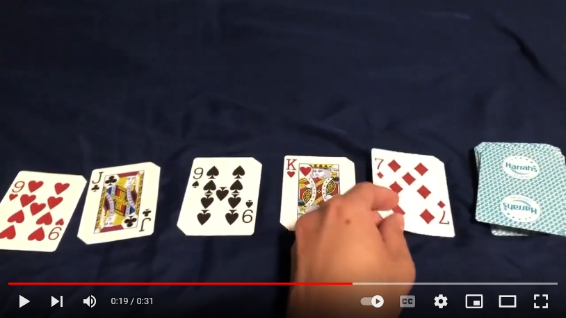
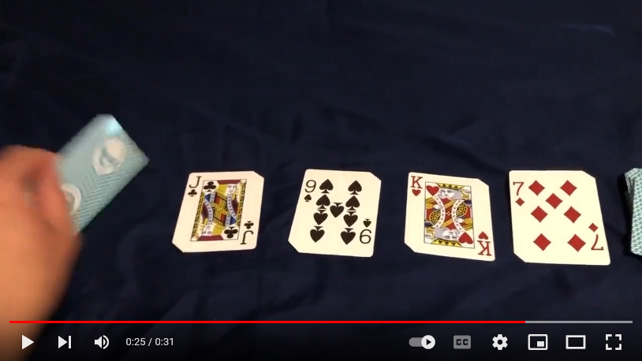

# The Queue

Back to [Welcome](welcome.md)

## Introduction
The queue is a simple data structure that follows a First In First Out (FIFO) setup. Queues are useful when you want to *keep* and *use* items in the order in which they were added.

The two main functionalities of a queue are **enqueue** and **dequeue**.

[](https://youtu.be/xQ9i3Gsjq5s)

The **enqueue** functionality adds an item *to the back of the queue*. Above, I am are enqueuing the Seven of Diamonds.

[](https://youtu.be/xQ9i3Gsjq5s)

The **dequeue** functionality takes an item *from the front of the queue*. Above, I am dequeuing the Nine of Hearts.

See the **full video** below:

[Video Demonstration](https://youtu.be/xQ9i3Gsjq5s)

## Methods and Performance

There are a number of methods associated with the Queue. Here are the methods, what they do, and their Big O performance:

| Method | What it does | Big O Performance |
| - | - | - |
| enqueue | adds an item to the back of the queue | O(1) |
| dequeue | takes an item from the front of the queue | O(n)* |
| size | checks the size of the queue | O(1) |
| empty | checks if the queue is empty | O(1) |

*This is O(n) because, in our Python application of the Queue, we are using a Python List. For a Python list to remove an item from the front (index: 0), it must perform an O(n) operation by shifting the rest of the items one spot towards the front.

## Python Implementation

In Python, we could use a normal list (Python's word for dynamic array) for a queue.

Here is a solution to implement the above methods in Python for queue: `my_queue`.

| Method | Python |
| - | - |
| enqueue | `my_queue.append(my_value_to_add)` |
| dequeue | `my_value_to_receive = my_queue.pop(0)` |
| size | `len(my_queue)` |
| empty | `len(my_queue) == 0` |

## Some Possible Errors

### Not deleting an item during dequeue

It may happen (when using a Python list as a queue) that you do not actually remove the item you are dequeuing.

For example, if we were to try to access the first item from the queue like this...
```
first_item = my_queue[0]
```
we would not actually be dequeuing the first item. This is because that item would still be in the queue. It is crucial that we are sure to delete the item we are dequeuing so that the FIFO nature of the queue can be preserved.

To fix this, be sure to use `.pop(0)` or `del`:
```
first_item = my_queue.pop(0)
```
```
first_item = my_queue[0]
del my_queue[0]
```

### Trying to dequeue from an empty queue

It may happen that you get an error when you are trying to dequeue from a queue. This could be because the queue is empty. It may be helpful to provide some robustness to your dequeue implementation (shown here in a function):
```
def dequeue():
    if not(len(my_queue) == 0):
        return my_queue.pop(0)
    else:
        print("queue was empty, returning None")
        return None
```

## Queue Example

### Scenario

Let's say there are five people that in a hospital lobby who are waiting to see a doctor. The arrived in this order:

1. Mike
2. Dustin
3. Will
4. Jonathan
5. Steve

The hospital has a policy that whoever has been waiting the longest shall be the next to see the doctor. How could one use a queue to implement this policy?

### Solution

Let's enqueue the patients to a queue in the order in which they arrived to the hospital. Then, let's dequeue them from the queue in order to be seen by the doctor in the proper order...

```
# make the queue (we will use a Python list)
lobby = []

# define this display_lobby function to make it a bit more readable
def display_lobby(lobby):
    # display the lobby queue
    print(f"Lobby: {lobby}\n")

display_lobby(lobby)

print("ENQUEUES:\n")

# enqueue the patients in the order in which they arrived
lobby.append("Mike")
display_lobby(lobby)
lobby.append("Dustin")
display_lobby(lobby)
lobby.append("Will")
display_lobby(lobby)
lobby.append("Jonathan")
display_lobby(lobby)
lobby.append("Steve")
display_lobby(lobby)

print("DEQUEUES:\n")

# dequeue the members of the lobby in the proper order
# use a while loop to continue dequeuing until the lobby is empty

while not(len(lobby) == 0):
    patient_to_be_seen = lobby.pop(0)
    display_lobby(lobby)
```
Here is the output:
```
Lobby: []

ENQUEUES:

Lobby: ['Mike']

Lobby: ['Mike', 'Dustin']

Lobby: ['Mike', 'Dustin', 'Will']

Lobby: ['Mike', 'Dustin', 'Will', 'Jonathan']

Lobby: ['Mike', 'Dustin', 'Will', 'Jonathan', 'Steve']

DEQUEUES:

Lobby: ['Dustin', 'Will', 'Jonathan', 'Steve']

Lobby: ['Will', 'Jonathan', 'Steve']

Lobby: ['Jonathan', 'Steve']

Lobby: ['Steve']

Lobby: []

```
Notice how the **enqueues** *add* items to the *back* of the queue while the **dequeues** *take* items from the *front* of the queue.

## Practice Problem

### Scenario

Using queues, take the contents of [O.txt](O.txt) and make a new file called O_separate.txt with the lines (from [O.txt](O.txt)) with an odd number of *O*'s lined up and then the lines with an even number of *O*'s lined up.

This is what the contents of O_separate.txt should look like:
```
O
OOO
OOOOO
OOOOOOO
OOOOOOOOO
OOOOOOOOOOO
OOOOOOOOOOOOO
OOOOOOOOOOOOOOO
OOOOOOOOOOOOOOOOO
OOOOOOOOOOOOOOOOOOO
OOOOOOOOOOOOOOOOOOOOO
OOOOOOOOOOOOOOOOOOOOOOO
OOOOOOOOOOOOOOOOOOOOOOOOO
OOOOOOOOOOOOOOOOOOOOOOOOOOO
OOOOOOOOOOOOOOOOOOOOOOOOOOOOO
OOOOOOOOOOOOOOOOOOOOOOOOOOOOOOO
OOOOOOOOOOOOOOOOOOOOOOOOOOOOOOOOO
OOOOOOOOOOOOOOOOOOOOOOOOOOOOOOOOOOO
OOOOOOOOOOOOOOOOOOOOOOOOOOOOOOOOOOOOO
OOOOOOOOOOOOOOOOOOOOOOOOOOOOOOOOOOOOOOO
OOOOOOOOOOOOOOOOOOOOOOOOOOOOOOOOOOOOOOOOO
OOOOOOOOOOOOOOOOOOOOOOOOOOOOOOOOOOOOOOOOOOO
OOOOOOOOOOOOOOOOOOOOOOOOOOOOOOOOOOOOOOOOOOOOO
OOOOOOOOOOOOOOOOOOOOOOOOOOOOOOOOOOOOOOOOOOOOOOO
OOOOOOOOOOOOOOOOOOOOOOOOOOOOOOOOOOOOOOOOOOOOOOOOO
OO
OOOO
OOOOOO
OOOOOOOO
OOOOOOOOOO
OOOOOOOOOOOO
OOOOOOOOOOOOOO
OOOOOOOOOOOOOOOO
OOOOOOOOOOOOOOOOOO
OOOOOOOOOOOOOOOOOOOO
OOOOOOOOOOOOOOOOOOOOOO
OOOOOOOOOOOOOOOOOOOOOOOO
OOOOOOOOOOOOOOOOOOOOOOOOOO
OOOOOOOOOOOOOOOOOOOOOOOOOOOO
OOOOOOOOOOOOOOOOOOOOOOOOOOOOOO
OOOOOOOOOOOOOOOOOOOOOOOOOOOOOOOO
OOOOOOOOOOOOOOOOOOOOOOOOOOOOOOOOOO
OOOOOOOOOOOOOOOOOOOOOOOOOOOOOOOOOOOO
OOOOOOOOOOOOOOOOOOOOOOOOOOOOOOOOOOOOOO
OOOOOOOOOOOOOOOOOOOOOOOOOOOOOOOOOOOOOOOO
OOOOOOOOOOOOOOOOOOOOOOOOOOOOOOOOOOOOOOOOOO
OOOOOOOOOOOOOOOOOOOOOOOOOOOOOOOOOOOOOOOOOOOO
OOOOOOOOOOOOOOOOOOOOOOOOOOOOOOOOOOOOOOOOOOOOOO
OOOOOOOOOOOOOOOOOOOOOOOOOOOOOOOOOOOOOOOOOOOOOOOO
OOOOOOOOOOOOOOOOOOOOOOOOOOOOOOOOOOOOOOOOOOOOOOOOOO
```

### Solution

When you are ready, view my [solution](queue_solution.py)